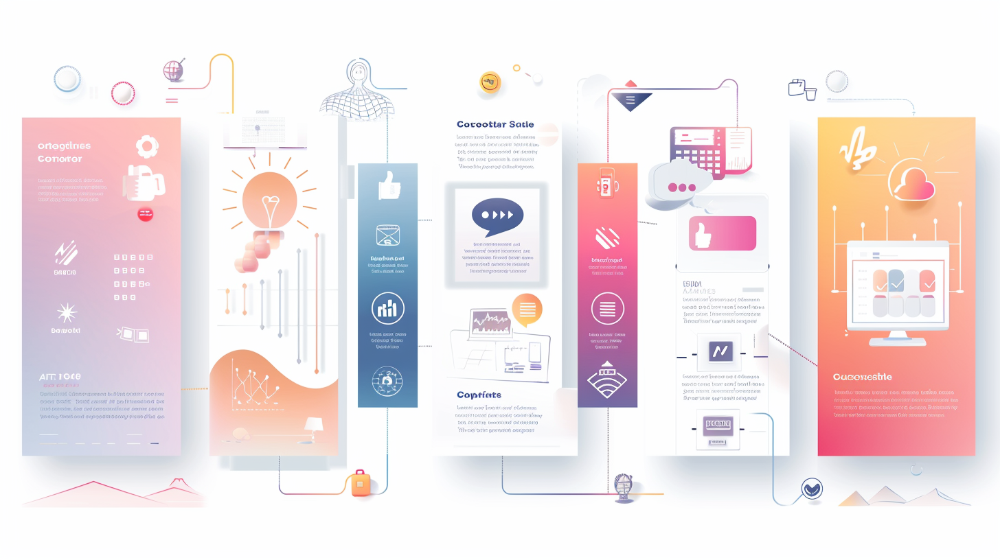

# 自媒体人 AI 工具指南

## 从 0 到 1 入门路线图
> 适合完全小白的自媒体 AI 工具学习路线  
1. **明确目标**：确定你是做短视频、图文、还是多平台运营。  
2. **必备账号**：注册 ChatGPT / 其他替代工具、AI 绘图工具、剪辑工具账号。  
3. **核心技能学习**：从内容策划、文案写作到视觉制作。  
4. **小规模试水**：用 AI 完成首个作品并发布。  
5. **数据复盘与迭代**：根据反馈调整内容方向与选题。  

---

# 自媒体人 AI 工具指南

> 🎯 **定位**：本指南专为希望通过 AI 工具提升内容创作效率、质量和影响力的自媒体人打造。  
> 目标是让你从零开始快速搭建自己的 AI 创作体系。

---

## 📌 目录
1. [必备 AI 工具推荐](#必备-ai-工具推荐)
2. [提升效率工具](#提升效率工具)
3. [创意与设计工具](#创意与设计工具)
4. [高频 Prompt 模板](#高频-prompt-模板)

### 迷你 Prompt 卡片（进阶用法）

| 功能 | 使用场景 | 直接可用 Prompt |
|------|----------|-----------------|
| 视频脚本生成 | 为 1 分钟短视频快速写好有趣的分镜脚本 | “帮我写一个 60 秒的短视频脚本，主题是【XXX】，包括 3 个分镜，每个分镜用一句话描述，语气幽默吸引人。” |
| 图文标题优化 | 给文章或社交媒体配一条更抓人的标题 | “帮我优化标题：【XXX】，生成 5 个更吸引人的标题，每个不超过 15 字。” |
| 配音文案润色 | 让配音更口语化自然 | “将以下文案改成适合配音的自然口语：【XXX】。” |
| 热点话题植入 | 将品牌内容巧妙融入当下热点 | “帮我写一篇围绕【热点事件】的 200 字短文，自然融入【品牌/产品】，保持轻松幽默。” |
| 评论区引导语 | 在评论区引发讨论和互动 | “为【话题】生成 3 条吸引人回复的评论引导语，语气轻松有趣。” |

5. [实战案例](#实战案例)
6. [7 天入门计划](#7-天入门计划)
7. [下一步行动](#下一步行动)

---

## 🛠 必备 AI 工具推荐

| 工具名称 | 一句话亮点 | 适用场景 | 费用 | 难度 | 官网 | 可替代工具 |
|:---:|---|---|:---:|:---:|:---:|:---:|
| **ChatGPT** | 文本生成、写作助手、脚本优化 | 视频脚本、标题文案、创意点子 | 免费+付费 | ⭐ | [访问](https://chat.openai.com) | [DeepSeek Chat](https://chat.deepseek.com/) |
| **Claude** | 长文本处理强、逻辑严谨 | 长篇文章、策划案撰写 | 免费+付费 | ⭐⭐ | [访问](https://claude.ai) | [通义千问](https://tongyi.aliyun.com/qianwen/) |
| **Notion AI** | 笔记与自动化写作结合 | 内容归档、创作流程管理 | 付费 | ⭐⭐ | [访问](https://www.notion.so/product/ai) | [WPS AI](https://ai.wps.cn/) |
| **Canva** | 图文设计一体化 | 封面图、社交媒体配图 | 免费+付费 | ⭐ | [访问](https://www.canva.com) | [创客贴](https://www.chuangkit.com/) |
| **CapCut** | 全能短视频剪辑 | 视频剪辑、字幕、特效 | 免费 | ⭐⭐ | [访问](https://www.capcut.com) | - |

> 💡 **建议**：从 ChatGPT + Canva + CapCut 三件套开始，能立刻覆盖文案、设计、视频三个核心环节。

---

## ⚡ 提升效率工具

| 工具名称 | 亮点 | 适用场景 | 费用 | 难度 | 官网 | 可替代工具 |
|:---:|---|---|:---:|:---:|:---:|:---:|
| **Zapier** | 多平台自动化 | 自动发帖、数据同步 | 付费 | ⭐⭐⭐ | [访问](https://zapier.com) | [简道云自动化](https://www.jiandaoyun.com/) |
| **Make.com** | 可视化自动化流程 | 跨平台 AI 工作流 | 免费+付费 | ⭐⭐ | [访问](https://www.make.com) | [钉钉宜搭](https://www.dingtalk.com/product/yida) |
| **Grammarly** | 英文写作优化 | 海外内容发布 | 免费+付费 | ⭐ | [访问](https://www.grammarly.com) | [秘塔写作猫](https://xiezuocat.com/) |
| **Descript** | 音视频转文字+编辑 | 播客剪辑、配音替换 | 付费 | ⭐⭐ | [访问](https://www.descript.com) | [讯飞听见](https://www.iflyrec.com/) |

---

## 🎨 创意与设计工具

| 工具名称 | 亮点 | 适用场景 | 费用 | 难度 | 官网 | 可替代工具 |
|:---:|---|---|:---:|:---:|:---:|:---:|
| **Midjourney** | 高质量 AI 绘图 | 封面图、背景图 | 付费 | ⭐⭐⭐ | [访问](https://www.midjourney.com) | [文心一格](https://yige.baidu.com/) |
| **Leonardo AI** | 多风格插画生成 | 社交海报、插画 | 免费+付费 | ⭐⭐ | [访问](https://leonardo.ai) | [通义万相](https://tongyi.aliyun.com/wanxiang/) |
| **Runway** | 视频生成与特效 | 短视频特效、动态背景 | 免费+付费 | ⭐⭐ | [访问](https://runwayml.com) | [万兴喵影·AI](https://www.wondershare.cn/filmora/) |

---

## ✍ 高频 Prompt 模板
> 使用提示：把方括号里的 **[变量]** 换成你的信息即可；若输出不满意，补充平台、受众、字数与语气再试一次。

| 用途分类 | 用途说明 | 高效 Prompt 示例 | 优化技巧 |
|---|---|---|---|
| 选题/灵感 | 生成高潜力话题清单 | 生成与 **[领域]** 相关、适合 **[平台]** 的 **10** 个选题，每条附一句角度说明（≤12字）。受众：**[人群画像]**。 | 要求“按热度排序/标出素材来源”。 |
| 标题生成 | 产出高点击标题 | 基于 **[主题]** 生成 **8** 个标题（≤12字），包含数字/对比/悬念三类各不少于2条，并按吸引力排序。 | 指定“口语化/专业向”，限制字数。 |
| 短视频脚本 | 30–60秒分镜脚本 | 我在 **[平台]** 做 **[类型]** 视频，时长 **[时长]** 秒，受众 **[人群]**。请输出：①3–5秒钩子②主体三点+镜头建议③结尾互动语。语气：**[风格]**。 | 不满意就让它“再给2套不同风格”。 |
| 封面文案 | 主副标题 + 视觉建议 | 为主题 **[主题]** 生成 **1** 句主标题（≤10字）+ **1** 句副标题（≤16字），并附一条视觉建议（配色/元素/构图比例）。 | 指定比例如 16:9/1:1；强调品牌关键词。 |
| 配图/海报 | MJ/Canva 配合出图 | 为 **[平台]** 封面生成 **[风格]** 图片：主题 **[主题]**，色调 **[色系]**，构图 **[比例]**，包含 **[元素]**，整体商务简洁。 | 把图片比例/色系/元素写清，减少走样。 |
| 口播改写/配音 | 口语化 + 分段 | 将下文改写为适合配音的口语体，并按 **[总时长]** 秒分段给出（每段给秒数）。文本：**[粘贴原稿]** | 要求“更口语/节奏更快/加口头禅点缀”。 |
| 社交互动 | 评论区互动问题 | 围绕 **[主题]** 生成 **6** 条评论区问题（≤15字），提高互动与停留，适配 **[平台]** 的语气。 | 多用开放式问题与表情符号。 |
| 跨平台改写 | 一稿多发适配 | 请把下文改写成 **[目标平台]** 风格，保留核心信息，输出：标题/分行正文/结尾互动问题。文本：**[粘贴原文]** | 列出“平台差异要点”供继续迭代。 |
| 发布文案/标签 | 上线即用的描述 | 生成 **[平台]** 的发布文案（≤80字）+ **10** 个标签（含长短词搭配），主题 **[主题]**，受众 **[人群]**。 | 让它按“检索量”排序标签。 |
| 数据复盘 | 找到下一条方向 | 依据下列数据（标题/播放/停留/转化），总结：①最佳3个主题②失败共性③下周试验建议（5条）。数据：**[粘贴数据]** | 让它输出“优先级+预计指标”。 |

---

---

---

### 💡 使用技巧
- **场景化**：Prompt 必须指明平台、受众、形式（短视频/图文/直播）  
- **分步输出**：让 AI 按“开头-中间-结尾”或时间分段输出，更易用  
- **反复迭代**：多次修改 Prompt 关键词，直到内容满意为止
## 📂 实战案例

1. **短视频场景**：利用 ChatGPT 写脚本 → Canva 制作封面 → CapCut 剪辑 → 发布到抖音
2. **小红书图文**：用 ChatGPT 生成文案 → Midjourney 出图 → Canva 版面排版
3. **直播预告**：ChatGPT 编写直播话术 → Canva 制作宣传图 → 多平台同时发布

---

## 🗓 7 天入门计划

| 天数 | 任务 |
|------|------|
| 第 1 天 | 注册 ChatGPT、Canva、CapCut |
| 第 2 天 | 用 ChatGPT 生成 1 条脚本并尝试剪辑 |
| 第 3 天 | 设计 1 张视频封面图 |
| 第 4 天 | 用 Midjourney 生成 1 张主题图 |
| 第 5 天 | 尝试用 Make.com 或 Zapier 做简单自动化 |
| 第 6 天 | 产出并发布 1 条完整内容 |
| 第 7 天 | 回顾并优化工作流 |

---

## 🚀 下一步行动
- 从「必备工具」中选择 2–3 个先上手
- 设定每周固定的创作目标
- 将 AI 工具逐步嵌入日常创作流程

---

## 下一步行动建议
- **先挑 1-2 个工具深度用起来**，而不是同时学太多。  
- **做一个 7 天挑战**：每天用 AI 产出并发布一条内容。  
- **加入社群**：找同领域的小伙伴交流经验。  
- **持续记录案例**：把自己成功的 AI 用法沉淀下来。  

---

## 常见问题（FAQ）
**Q1：我完全没经验，先学哪个工具？**  
A：建议先学 ChatGPT（或替代品）作为文案大脑，再配合一个 AI 图片/视频生成工具。  

**Q2：需要花很多钱才能开始吗？**  
A：不一定，很多工具都有免费版或平替版本。  

**Q3：怎么保证作品不“AI味”太重？**  
A：混合 AI + 个人创作，比如用 AI 起草、你自己润色调整。  

**Q4：如何避免创作卡壳？**  
A：提前准备“高频 Prompt 模板”，一键生成思路。  

---